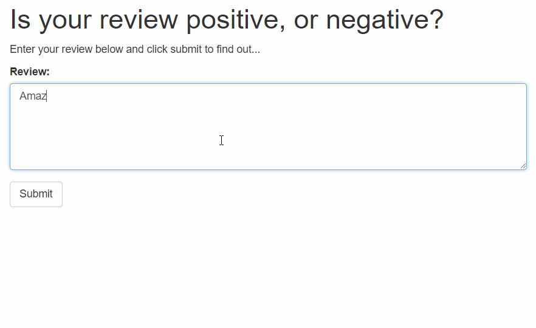

# Deploying-Sentiment-Analysis-Model-Using-SageMaker

This is the final project in Udacity Deep Learning Nanodegree program which consists in deploying a Sentiment Analysis model using LSTM RNN in the Amazon AWS SageMaker tool.The goal is to build a very simple web page in which a user can submit a movie review and the prediction model behind the scenes will predict whether it is Positive or Negative review. The prediction model is implemented using Pytorch framework and trainned on IMDB dataset.

In the final architecture AWS API Gateway and AWS Lambda functions is used as well. The application architecture diagram is:

 


## Project Overview

This entire project is done on Amazon sagemaker and uses some heavy GPU instances for training the models. If you want execute this on local machine, you might want to train the model on subset of the training data from IMDB dataset. Also there are steps where we upload the data to amazon S3 instances in order to train using aws instances which you can totally ignore on local machines

### Instructions to execute in sagemaker

1. Clone the repository.
	```
		git clone https://github.com/nihithreddy/Deploying-Sentiment-Analysis-Model-Using-SageMaker/blob/master/README.md
	```
2. Open the `SageMaker Project.ipynb` file.
	```
		jupyter notebook SageMaker Proejct.ipynb
	```
3. Read and follow the instructions! You can find and download the dataset for this project in the notebook.


### General Outline

- Step 1: Downloading the data
- Step 2: Preparing and Processing the data
- Step 3: Upload the data to S3
- Step 4: Build and Train the PyTorch Model
- Step 5: Testing the Model
- Step 6: Deploying the model for testing
- Step 7: Use the model for testing
- Step 8:  Deploy the model for the web app
- Step 9:  Use the model for the web app

### Libraries

The list below represents main libraries and its objects
for the project.
- [Amazon SageMaker](https://ap-northeast-2.console.aws.amazon.com/sagemaker/home?region=ap-northeast-2#/landing) (Build, train, and deploy a model)
- [tensorflow](https://www.tensorflow.org/) (LSTM classifier)


## Web app final result

The final project will be executed in a simple html page which can be deployed anywhere. 

You will see the following:

 

### Delete the Endpoint
Remember to always __SHUT DOWN YOUR ENDPOINT__ if you are no longer using it. You are charged for the length of time that the endpoint is running so if you forget and leave it on you could end up with an unexpectedly large bill.
```
	predictor.delete_endpoint()
```

